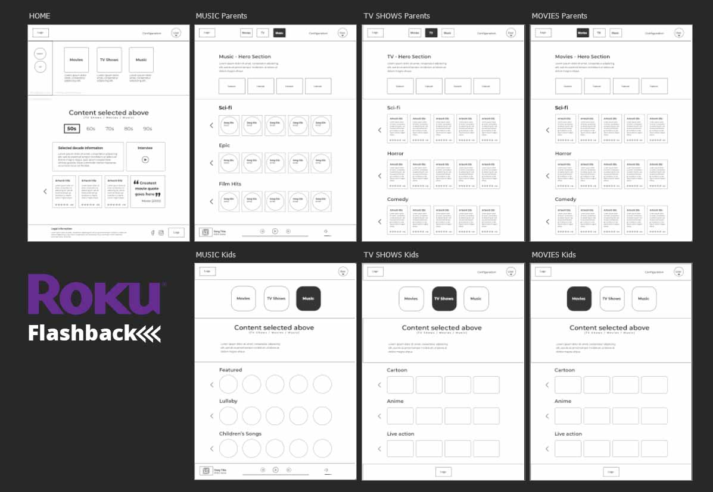

# FLASHBACK

# What's included in this repo?
Course deliverables in this repo:

1. Layout in PSD (at assets folder)
2. MySQL datababase of 10 movie placeholders.
3. Data fetch and render view.
4. Files and folders structured.
5. Dev notes.
6. web layout.

# Prototype: [Prototype](https://ruben741163.invisionapp.com/console/share/3M1XOUWYHT/496937213)
# Dev notes: [Dev notes](https://docs.google.com/document/d/1ST_VoefA5jk7u4lU7tKrKzcldExtyX1Gkv9epnkSiv8)

## Description
The Flashback app is part of the Roku streaming service. Subscribers can use this app to
access three separate flashback features; movies, television and music. Each of these three
sections are comprised exclusively of entertainment from 1950, 1960, 1970, 1980, and 1990. 

The Website will be developed with HTML, CSS, Javascript, PHP, MySQL and modular SASS. It will use AJAX to request dynamic content from a database.

## Author

* **Ruben Osorio** - *Designer* - [Digital Ruben](https://github.com/digitalruben)
* **Ruben Osorio** - *Developer* - [Digital Ruben](https://github.com/digitalruben)

## License

This project is licensed under the MIT License - see the [LICENSE.md](https://opensource.org/licenses/MIT) file for details

## Acknowledgments

Fanshawe College
2020