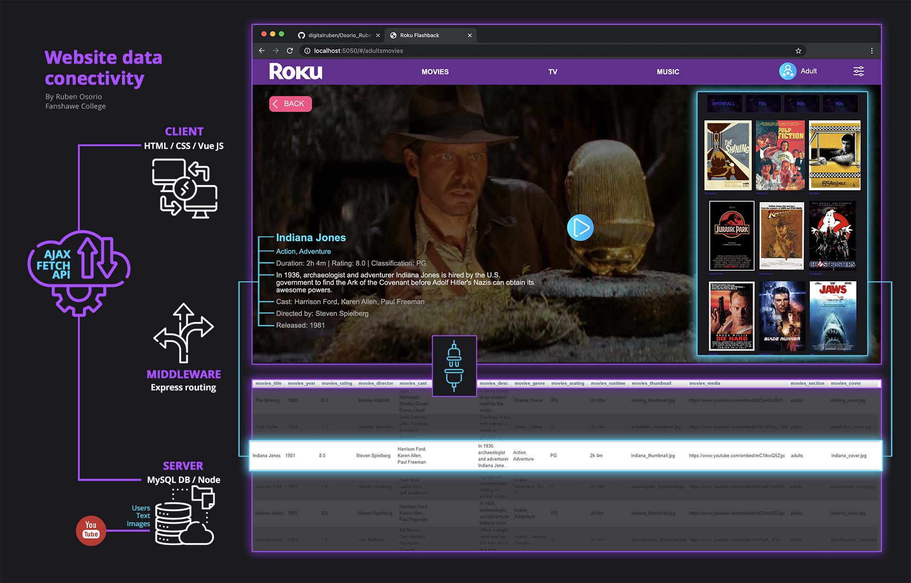

# ROKU FLASHBACK


# Important > Client server [Here for dowload:](https://github.com/digitalruben/Osorio_Ruben-RokuServer)
```
The Database is inside the server repo provided above.
```
## Login info:

Username: user1 / pass: password

## Dev notes: [Dev notes](https://docs.google.com/document/d/1JywtqlMeNHfK0AKIwHDUFA3nYBQM-E8Lm2lNwVU2c0g/)

## Developer notes
The Roku Flashback is being developed based on the NEVM stack (Node, Express, Vue, MySql). This framework methodology is helpful in serving the database content for the end user in combination with AJAX, JavaScript and Express routing for client and server side loading.

The development project is based on the app design and prototype for choosing the Vue components for routing and rendering the views.

## Languages and technologies used:
- NPM > Package management
- NODE > Server
- EXPRESS > Routing framework
- HBS > Templating structure
- HTML/CSS/JS > Web structure
- Vue JS > Front-End Framework
- MySQL > Relational Database
- AJAX > Fecthing data

## Features
- Developed using the NEVM stack (Node, Express, Vue, MySql)
- API providing access to more than 30 media content 
- MySql database serving text, audio, video and images.
- Data via AJAX on initial load during runtime using Fetch API and Vue.js 
- Data retrieval routing with Node and Express on the back end.
- Server-side and client-side rendering.
- Client-side routing.
- Relation MySQL database.

## Project assets provided
- Client and server environments
- Database
- Github repo
- Readme
- Assets, layouts, views and components.
- SASS elements with colour values, CSS and transition specs. 
- Prototype and design
- Commented code

## Author

- **Ruben Osorio** - _Designer_ - [Digital Ruben](https://github.com/digitalruben)
- **Ruben Osorio** - _Developer_ - [Digital Ruben](https://github.com/digitalruben)

## License

This project is licensed under the MIT License - see the [LICENSE.md](https://opensource.org/licenses/MIT) file for details

## Acknowledgments

Fanshawe College
2021
